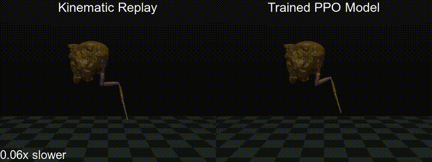

# FlyMimic 🪰


[](https://opensource.org/licenses/Apache-2.0)
[](https://www.python.org/)
[](https://github.com/gizemozd/FlyMimic/issues)

<div align="center">
  <br><br>
</div>

**FlyMimic** is the codebase for the imitation learning experiments in the paper:
> [**Musculoskeletal simulation of limb movement biomechanics in _Drosophila melanogaster_**](https://arxiv.org/abs/2509.06426)


This repository hosts:
- Musculoskeletal model of the fly legs with different joint passive properties
- Motion capture data of fly walking behavior
- RL tasks compatible with [dm_control](https://github.com/deepmind/dm_control)
- Imitation learning training with PPO [Stable Baselines3](https://github.com/DLR-RM/stable-baselines3)


> [!NOTE] 
> This repository focuses on imitation learning experiments and provides MuJoCo models converted from OpenSim. For the original muscle model development and parameter optimization in OpenSim, please refer to [this repository](https://github.com/gizemozd/neuromechfly-muscles).

-----

## Installation

To install flymimic, clone the repository:

```bash
git clone https://github.com/gizemozd/FlyMimic.git
cd FlyMimic
```

Then, create a virtual environment, and install the required dependencies:
```bash
conda create -n flymimic python=3.10
conda activate flymimic
pip install -e .
```

(Optional) To install the optional dependencies for visualization, run:

```bash
pip install -e ".[viz]"
```

To install the development dependencies, run:

```bash
pip install -e ".[dev]"
```

## Quick Start

```bash
# Train a model
python scripts/train_muscle.py

# Evaluate the trained model
python scripts/eval_rollout.py
```

## Training

To train a model with a custom configuration:
```bash
python scripts/train_muscle.py --config-name=train_arm
```

## Evaluation

To evaluate a trained model:
```bash
python scripts/eval_rollout.py model_path=./logs/demo_model.zip
```

> [!NOTE]
> You can download the other trained models from [here](https://www.dropbox.com/scl/fi/ci4u7cvruikzsifbtra8v/logs.zip?rlkey=3surtpetvj48jvqyaa0m21stq&st=raxl8594&dl=0).

## Repository Structure
```plaintext
FlyMimic/
├── flymimic/
│   ├── assets/          # MuJoCo models and motion capture data
│   ├── config/          # Hydra configuration files
│   ├── env/             # Wrappers for dm_control
│   ├── evaluation/      # Evaluation tools
│   ├── tasks/           # RL environment tasks
│   ├── train/           # Training modules
│   └── utils/           # Utility functions
├── scripts/             # Training and evaluation scripts
└── logs/               # Training outputs and saved models
```

## Citation

If you use flymimic in your research, please cite our paper:

```bibtex
@inproceedings{ozdil2026musculoskeletal,
  title={Musculoskeletal simulation of limb movement biomechanics in Drosophila melanogaster},
  author={Ozdil, Pembe Gizem and Ning, Chuanfang and Phelps, Jasper S and Wang-Chen, Sibo and Elisha, Guy and Ijspeert, Auke and Ramdya, Pavan},
  booktitle={The Fourteenth International Conference on Learning Representations},
  year={2026}
}
```
